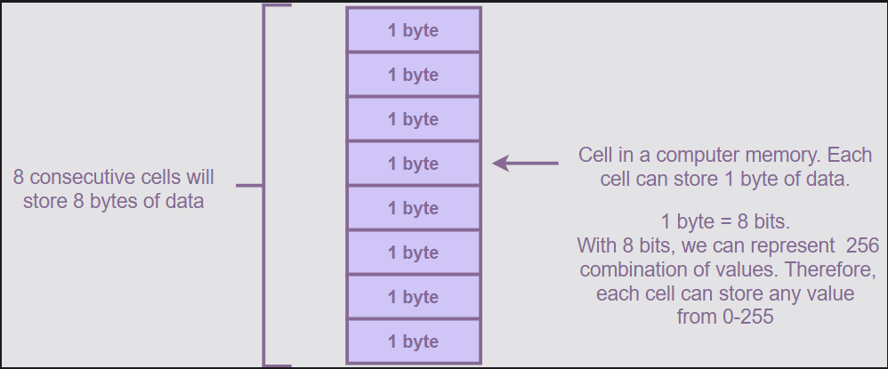

# Lesson 1: A Bit About C++

## 1. What is C++ ?

- C++ is a general-purpose, object-oriented programming language.

- It is an extension of C.

- Depending on our requirements, we can use C++ to either code in “C style” or “object-oriented style”.

## 2. C++ features?


### Platform dependent

- Program written and complied on a only operating system.
- Ex: C++ dev and complied in Window can't run on macOS, Linux, Android OS.

### Intermediate-level language

- Features of both high-level and low-level programming languages.

### Object-oriented

- C++ is an object-oriented programming language (OOP). OOP makes development easier by breaking a complex problem into subproblems using objects

### Structured

- We can divide a program into different parts using functions.

### Statically-typed

- C++ is a statically-typed language, the variable types are explicitly declared and are determined at compile time.

### Compiled

- C++ is a compiled programming language, which means that programs written on it cannot be executed without compilation.

### Support-rich library

### Speed

- The compilation and execution time of C++ is much faster 

### Multi-paradigm

- C++ supports different styles of programming.

### Pointer

- ``C++ supports the features of pointers. Pointers are used to interact with the memory.``

## 3. The History of C++


# Lesson 2: Variables in C++

## 2.1 Variable declaration

- Syntax basic:

    ```    <vari_data_type> <vari_data_name>```

- The number is an identifier.


- We can declare more than one variable in a single line.

```c++
    int number1, number2, number3;
```

## 2.2 Variable declaration and initialization in one step#

```c++
#include <iostream>

using namespace std;

int main() {
  int number = 100;
}
```


## 2.2 Identifiers in C++

A variable in C++ is given a unique name that is known as an identifier.

### Rules for naming a variable

Note:

- C++ is a case-sensitive language. Therefore, an identifier written in the upper case will be different from one written in lower case.

- Numbers and Numbers are two different identifiers.


## 2.3 C++ Constants/Literals

Constants are similar to variables except that we can’t change their value during the code execution.

In C++, we can use the const keyword to declare a constant. The basic syntax for creating a constant is:

    const <data_type> <data_name> = <value>

`❌  Common programming error: In C++, you have to initialize a constant at the time of its declaration. If you don’t initialize a constant at the time of creating it, an error will occur.`

# Lesson 3: Data Types

## 3.1 Introduction to computer memory

